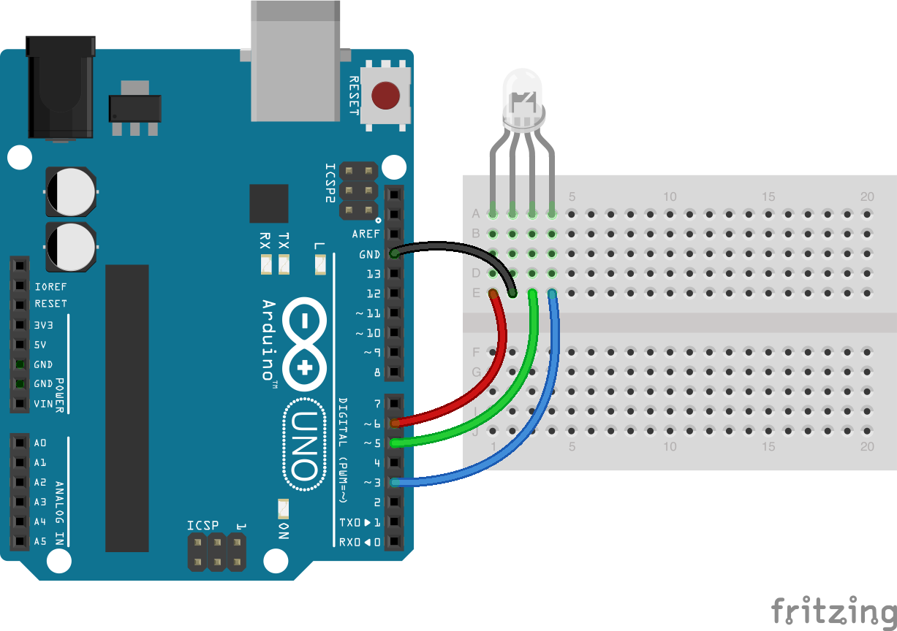

# Change led color

_We can change the color of an RGB led, using Arduino, Node.js, Socket.io_

## Start 🚀

* ** 2 _Connect the cables and components with the arduino



* ** 2 _Connect the arduino to PC._

_To start you just need to have the project locally, open the console in the project path and run the command._

```
npm init 
```

_then run._

```
nodemon app.js 
```

## Built with 🛠️

* [Node.js](https://nodejs.org/es/) - Server.
* [Socket.io](https://socket.io/) - Real Time.
* [Johnny-Five](http://johnny-five.io/) - framework to work wiht Arduino.
* [Bootstrap](https://getbootstrap.com/) - Css.


---
⌨️ con ❤️ por [Juan Teixeira](https://github.com/JuanTeix) 😊